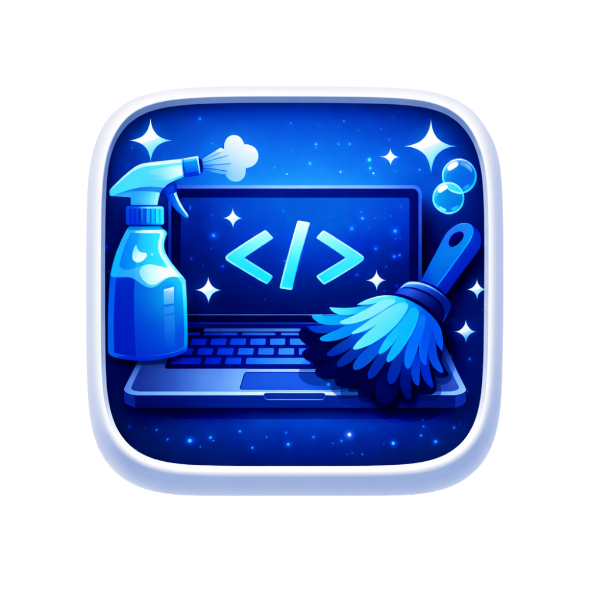

# Dev Cleaner

<p align="center">
  
</p>

Dev Cleaner is a desktop app for keeping developer workspaces lean. It scans selected roots, surfaces heavy artifacts (like `node_modules`, build outputs, caches), and helps you clean them safely with clear previews, system telemetry, and a configurable menu bar widget.

## Table of Contents

- Features
- Screens & Workflows
- Menu Bar Widget
- Scheduled Scans
- Data & Safety
- Tech Stack
- Project Structure
- Development
- Build & Packaging
- Troubleshooting
- License

## Features

- **Workspace scanning**
  - Multi‑root scanning for developer junk folders
  - Smart grouping by scan root with per‑project totals
  - Quick “clean selected” and “clean all” actions
- **Cleanup previews**
  - See size, path, and folder counts before deleting
  - Confirm dialog for destructive actions
  - Cleanup totals persisted locally
- **System telemetry**
  - CPU load and load averages
  - Memory usage, swap usage, pageouts
  - Disk usage and read/write throughput
  - Network inbound/outbound throughput and totals
  - Battery health, cycles, power status (macOS)
  - Wi‑Fi details, Bluetooth devices, open ports (where available)
- **Menu bar widget**
  - Compact system snapshot in the macOS menu bar
  - Toggle per‑section visibility (Disk/Memory/CPU/Battery/Latest Scan/Warning)
  - 3 GB junk warning when scan results exceed threshold
- **Scheduled scans**
  - Configurable scan interval in Settings
  - Runs in the background while the app is open
- **Mac maintenance tools**
  - System junk scan and clean
  - Large file scan + delete
  - Memory relief (terminate heavy processes owned by user)
  - Startup items list (read‑only)
- **Applications management (macOS)**
  - List installed apps
  - Reveal in Finder
  - Uninstall (move to Trash)
- **Developer tools inventory**
  - Installed tooling list (Python, Node, Docker, Git, etc.)
- **Preferences**
  - Target selection by ecosystem
  - Ignore list
  - Menu bar configuration
  - Scheduled scans

## Screens & Workflows

- **Dashboard**
  - Workspace health summary
  - Quick actions (Pick Folders, Start Scan)
  - Scan results preview
- **Scan Results**
  - Project list with sortable size/name
  - Root grouping with subtotals
  - Selective cleanup with confirmation
- **System**
  - Telemetry cards and detailed sections
  - Network interfaces and Wi‑Fi details
  - Battery health and power saving controls
- **Mac Cleaner**
  - Junk categories with size/file count
  - Large files scan and bulk delete
  - Memory relief for heavy processes
  - Startup items overview
- **Applications**
  - Installed apps list with icons and metadata
  - Reveal or uninstall
- **Settings**
  - Scan defaults, ignore list, and scan schedule
  - Menu bar widget visibility and sections
  - Cleanup totals and reset

## Menu Bar Widget

Configure which sections appear in **Settings → Menu Bar**:

- Disk usage
- Memory usage + swap pressure
- CPU load
- Battery status + power saving toggle
- Latest scan summary + quick scan button
- 3 GB warning banner

You can also toggle the entire widget visibility from the same section.

## Scheduled Scans

Scheduled scans run in the background while the app is open (including when the main window is hidden). Configure in **Settings → Scheduled Scans**.

## Data & Safety

- All scan configuration and totals are stored locally.
- Cleanup uses a preview + confirmation step.
- Deletions can be configured to move to Trash (where supported).
- Only current‑user processes can be terminated in Memory Relief.

## Tech Stack

- **Electron** (main/renderer)
- **React 18** + **TypeScript**
- **Vite** + **electron‑vite**
- **Zustand** (state management)
- **Tailwind CSS**
- **Electron Builder** (packaging)

## Project Structure

- `electron/main` – main process services, IPC handlers, scheduler
- `electron/preload` – secure API bridge
- `electron/shared` – shared types/constants/schemas
- `src/app` – global styles + app shell
- `src/features` – feature pages and widgets
- `src/store` – Zustand stores
- `assets` – app icons and artwork

## Development

```bash
npm install
npm run dev
```

## Build & Packaging

```bash
# macOS (arm64)
npm run dist:mac

# Windows (x64)
npm run dist:win
```

## Troubleshooting

- **Dock icon doesn’t appear in DMG**  
  Ensure `assets/dev_clean_color.icns` is valid and rebuild the DMG.

- **Menu bar widget doesn’t update**  
  Check Settings → Menu Bar and ensure the widget is enabled.

## License

Private. All rights reserved.
